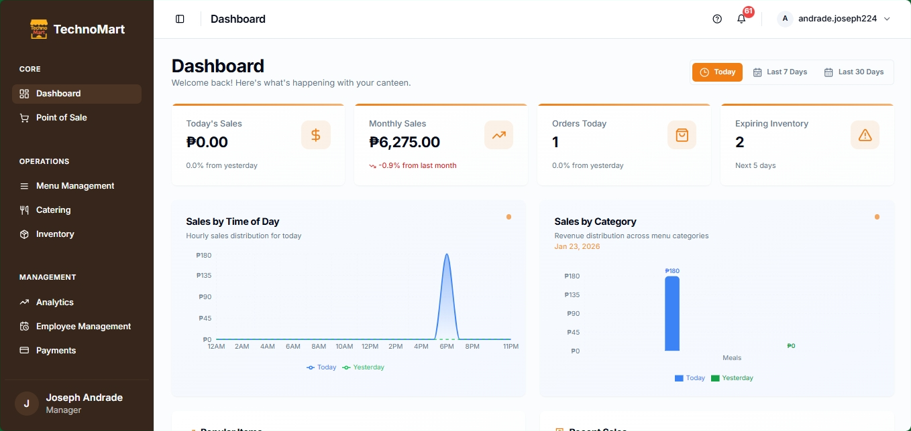

# TechnoMart Canteen Management System

A modern canteen ordering and operations platform for the CTU-MC Multipurpose Cooperative. TechnoMart digitizes ordering, payments, inventory, user management, and analytics with a responsive web app and a Django API.

- This repository contains the Vite + React frontend and the Django backend API.
- Default dev URLs: frontend http://localhost:8080 and API http://localhost:8000.

---

## Screenshot



---

## Features

- POS for walk-in and online orders with live queue updates.
- Menu management with availability toggles and image uploads.
- Inventory tracking with activity history and filters.
- Payments and transaction exports (PDF).
- Analytics dashboards and KPIs.
- Role-based access control and staff scheduling.
- Catering event orders and customer feedback.
- Email/password authentication plus Google sign-in.
- Verification flow with headshot capture and admin approval.
- Realtime notifications via Django Channels + Redis.

---

## Architecture

- SPA frontend talks to the API at `/api/*` (Vite dev proxy targets `http://localhost:8000`).
- JWT bearer tokens are issued after account approval.
- New users are created as `pending`; admins approve in-app or via Django admin.
- Headshots are stored in private media and served only through authenticated endpoints.

---

## Tech Stack

Frontend

- Vite 5, React 19, React Router 7
- Tailwind CSS, shadcn/ui (Radix UI primitives)
- TanStack React Query, Zod, React Hook Form
- Recharts, jsPDF for reporting

Backend

- Django 5.x (requirements allow 4.2-<6.0)
- MySQL 8, Redis (realtime), django-cors-headers
- django-allauth + google-auth, PyJWT

Tooling

- ESLint, Prettier, Husky, lint-staged

---

## Quick Start (Docker Compose)

1. Copy `backend/.env.example` to `backend/.env` and `.env.example` to `.env`.
2. Run `docker compose up --build` from the repo root.
3. Apply migrations: `docker compose exec api python manage.py migrate`.
4. Open http://localhost:8080 and confirm the API at http://localhost:8000/api/health/.
5. Optional: create an admin user:

```bash
docker compose exec api python manage.py bootstrap_admin --email "your-email@example.com" --password "your-strong-pass" --name "Admin" --role admin
```

---

## Local Development (without Docker)

Backend (Python 3.11+, MySQL 8)

```powershell
cd backend
python -m venv .venv
./.venv/Scripts/Activate.ps1
pip install -U pip setuptools wheel
pip install -r requirements.txt
python manage.py migrate
python manage.py runserver 0.0.0.0:8000
```

Frontend (Node.js 18+)

```bash
npm install
npm run dev
```

---

## Environment Configuration

Backend (`backend/.env`)

- Core: `DJANGO_SECRET_KEY`, `DJANGO_DEBUG`, `DJANGO_ALLOWED_HOSTS`
- Database: `DJANGO_DB_NAME`, `DJANGO_DB_USER`, `DJANGO_DB_PASSWORD`, `DJANGO_DB_HOST`, `DJANGO_DB_PORT`
- JWT: `DJANGO_JWT_SECRET`, `DJANGO_JWT_ALG`, `DJANGO_JWT_EXP_SECONDS`
- Google OAuth: `GOOGLE_CLIENT_ID`, `GOOGLE_CLIENT_SECRET`
- Realtime: `REDIS_URL`
- Email (optional SMTP): `DJANGO_EMAIL_BACKEND`, `DJANGO_DEFAULT_FROM_EMAIL`, SMTP vars

Frontend (`.env`)

- `VITE_API_BASE_URL` (default `/api` in dev)
- `VITE_DEV_PROXY_TARGET` (default `http://localhost:8000`)
- `VITE_ENABLE_MOCKS` (`false` for real API)
- `VITE_GOOGLE_CLIENT_ID` (Google One-Tap)

---

## Useful Commands

Frontend (from repo root)

- `npm run dev` - Vite dev server
- `npm run build` - production build
- `npm run preview` - preview build
- `npm run lint` / `npm run lint:fix`
- `npm run format`

Backend

- `python manage.py migrate`
- `python manage.py createsuperuser`
- `python manage.py bootstrap_admin --email "your-email@example.com" --password "your-strong-pass" --name "Admin" --role admin`

---

## Project Structure

- `src/` - React app (pages, hooks, components, API clients)
- `backend/` - Django app (models, views, middleware, urls)
- `public/` - static assets
- `docker-compose.yml` - dev stack (API, DB, Redis, frontend)
- `scripts/` - local helper scripts

---

## Troubleshooting

- API root `/` redirects to `/api/health/`.
- 500s from the frontend usually mean the API is not running or `VITE_ENABLE_MOCKS` is true.
- CORS errors: update `CORS_ALLOWED_ORIGINS` and `ALLOWED_HOSTS` in `backend/config/settings.py`.
